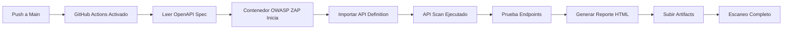

# 🔒 API DAST - Pruebas de Seguridad Automatizadas para APIs con OWASP ZAP


Pipeline automatizado de **Dynamic Application Security Testing (DAST)** para APIs REST usando **OWASP ZAP** integrado con GitHub Actions. Este proyecto utiliza especificaciones **OpenAPI/Swagger** para realizar pruebas de seguridad exhaustivas en APIs.

## 📋 Tabla de Contenidos

- [Descripción General](#-descripción-general)
- [Características](#-características)
- [Cómo Funciona](#-cómo-funciona)
- [Arquitectura del Proyecto](#-arquitectura-del-proyecto)
- [Requisitos Previos](#-requisitos-previos)
- [Uso](#-uso)
- [Resultados del Escaneo](#-resultados-del-escaneo)
- [Configuración del Workflow](#️-configuración-del-workflow)
- [Tecnologías Utilizadas](#️-tecnologías-utilizadas)
- [Consideraciones de Seguridad](#-consideraciones-de-seguridad)
- [Recursos Adicionales](#-recursos-adicionales)

---

## 🎯 Descripción General

Este repositorio contiene un **pipeline de CI/CD** que realiza automáticamente escaneos de seguridad en APIs REST utilizando **OWASP ZAP (Zed Attack Proxy)**. A diferencia del escaneo de aplicaciones web tradicionales, este proyecto se especializa en:

- **Análisis de APIs REST** mediante especificaciones OpenAPI
- Detección de vulnerabilidades específicas de APIs
- Pruebas automatizadas de endpoints
- Validación de autenticación y autorización
- Verificación de métodos HTTP y parámetros

### Vulnerabilidades Detectadas:

- Broken Authentication
- Broken Object Level Authorization (BOLA)
- Excessive Data Exposure
- Lack of Resources & Rate Limiting
- Security Misconfiguration
- Injection (SQL, NoSQL, Command)
- Mass Assignment
- Improper Assets Management
- Insufficient Logging & Monitoring

---

## ✨ Características

- ⚡ **Escaneo automatizado** activado en cada push o PR
- 📝 **OpenAPI/Swagger** como entrada para definición de API
- 🔍 **OWASP ZAP** especialmente configurado para APIs
- 📊 **Reportes HTML** generados automáticamente
- 🔄 **Workflow de GitHub Actions** para integración CI/CD
- 📦 **Almacenamiento de artifacts** para resultados
- 🎯 **API Security** basado en OWASP API Top 10
- 🔎 **Pruebas exhaustivas** de todos los endpoints

---

## 🔄 Cómo Funciona



### Flujo del Pipeline:

1. **Trigger**: Push a la rama `main` o ejecución manual del workflow
2. **Setup**: GitHub Actions runner inicia entorno Ubuntu
3. **OpenAPI**: Lee la especificación OpenAPI/Swagger desde `openapi.json`
4. **Importación**: OWASP ZAP importa la definición de API
5. **Escaneo**: ZAP ejecuta pruebas de seguridad en todos los endpoints
6. **Reporte**: Genera reporte HTML con los hallazgos
7. **Almacenamiento**: Artifacts subidos para revisión

---

## 🏗️ Arquitectura del Proyecto

```
zap-api-dast/
├── .github/
│   └── workflows/
│       └── main.yml          # GitHub Actions workflow
├── openapi.json              # Especificación OpenAPI/Swagger
├── README.md
├── LICENSE
└── .gitignore
```

### Especificación OpenAPI:

El archivo `openapi.json` contiene la definición completa de tu API:
- Endpoints disponibles
- Métodos HTTP permitidos
- Parámetros requeridos
- Esquemas de request/response
- Configuraciones de autenticación

---

## 📦 Requisitos Previos

- Repositorio de GitHub con Actions habilitado
- Especificación OpenAPI/Swagger de tu API
- API accesible para pruebas (staging/development)
- Conocimiento básico de seguridad de APIs

---

## 🚀 Uso

### 1. Clonar el Repositorio

```bash
git clone https://github.com/jhneira-sol/zap-api-dast.git
cd zap-api-dast
```

### 2. Actualizar Especificación OpenAPI

Reemplaza `openapi.json` con la especificación de tu API:

```bash
# Opción 1: Copiar archivo local
cp /path/to/your/openapi.json .

# Opción 2: Descargar desde URL
curl -o openapi.json https://api.ejemplo.com/openapi.json
```

### 3. Subir Cambios

```bash
git add openapi.json
git commit -m "Actualizar especificación OpenAPI"
git push origin main
```

### 4. Monitorear el Workflow

Navega a la pestaña **Actions** en GitHub para monitorear el progreso del escaneo.

### 5. Descargar Reporte

Una vez completado:
1. Ve a la ejecución del workflow
2. Desplázate a la sección **Artifacts**
3. Descarga el reporte HTML

---

## 📊 Resultados del Escaneo

El scanner OWASP ZAP genera un **reporte HTML** que contiene:

### Por Endpoint:
- URL del endpoint
- Método HTTP
- Parámetros probados
- Vulnerabilidades encontradas

### Por Vulnerabilidad:
- **Severidad**: Crítica, Alta, Media, Baja, Informativa
- **Tipo**: Según OWASP API Top 10
- **Descripción**: Detalles del hallazgo
- **Endpoints afectados**: Lista de URLs
- **Evidencia**: Request/Response de prueba
- **Recomendaciones**: Cómo remediar
- **Referencias**: CWE, OWASP

### Ejemplo de Estructura del Reporte:

```
📄 ZAP API Scanning Report
├── 🔴 Vulnerabilidades Críticas (0)
├── 🟠 Vulnerabilidades Altas (1)
│   └── Broken Authentication en /api/login
├── 🟡 Vulnerabilidades Medias (3)
│   ├── Excessive Data Exposure en /api/users
│   ├── Missing Rate Limiting en /api/search
│   └── Security Misconfiguration en /api/config
└── 🔵 Vulnerabilidades Informativas (5)
```

---

## ⚙️ Configuración del Workflow

El workflow de GitHub Actions está definido en `.github/workflows/main.yml`.

### Componentes Principales:

- **Trigger**: `push` a main branch, `workflow_dispatch` para ejecuciones manuales
- **Runner**: `ubuntu-latest`
- **OWASP ZAP Action**: API scan mode
- **Input**: `openapi.json`
- **Formato de Reporte**: HTML
- **Artifact Retention**: 30 días

### Opciones de Personalización:

Puedes modificar el workflow para:
- Agregar autenticación (API keys, OAuth, JWT)
- Configurar contextos de usuario
- Ajustar profundidad del escaneo
- Establecer timeouts
- Integrar con notificaciones Slack/Email
- Configurar security gates

---

## 🛠️ Tecnologías Utilizadas

| Tecnología | Propósito |
|------------|----------|
| **OWASP ZAP** | Scanner de seguridad dinámico para APIs |
| **OpenAPI/Swagger** | Especificación de API |
| **GitHub Actions** | Automatización CI/CD |
| **Docker** | Escaneo containerizado |
| **Ubuntu** | Entorno del runner |
| **HTML** | Generación de reportes |

---

## 🔐 Consideraciones de Seguridad

### ⚠️ IMPORTANTE:

- **Nunca escanear** APIs de producción sin autorización
- **Nunca hacer commit** de API keys o tokens
- **Usar ambientes** de staging/development para pruebas
- **Rate limiting** - Algunos endpoints pueden bloquear escaneos agresivos
- **Datos sensibles** - El reporte puede contener información sensible

### Mejores Prácticas:

1. ✅ Probar contra **entornos de desarrollo/staging** primero
2. ✅ Coordinar con el equipo de infraestructura
3. ✅ Revisar la especificación OpenAPI antes del escaneo
4. ✅ Configurar autenticación apropiada en ZAP
5. ✅ Revisar y clasificar hallazgos
6. ✅ Integrar en proceso de gestión de vulnerabilidades
7. ✅ Combinar con SAST para cobertura completa

### Diferencias API vs Web DAST:

| Aspecto | Web DAST | API DAST |
|---------|----------|----------|
| **Input** | URL | OpenAPI Spec |
| **Cobertura** | Páginas HTML | Endpoints JSON/XML |
| **Focus** | UI vulnerabilities | Business logic flaws |
| **Autenticación** | Cookies/Sessions | API Keys/JWT/OAuth |

---

## 📚 Recursos Adicionales

- [Documentación OWASP ZAP](https://www.zaproxy.org/docs/)
- [OWASP API Security Top 10](https://owasp.org/www-project-api-security/)
- [OpenAPI Specification](https://swagger.io/specification/)
- [GitHub Actions Documentation](https://docs.github.com/es/actions)
- [API Security Best Practices](https://owasp.org/www-project-api-security/)
- [ZAP API Scan Documentation](https://www.zaproxy.org/docs/docker/api-scan/)

---

<div align="center">

**⭐ Si encuentras útil este proyecto, considera darle una estrella!**

</div>