# 🔒 API DAST - Pruebas de Seguridad Automatizadas para APIs con OWASP ZAP


Pipeline automatizado de **Dynamic Application Security Testing (DAST)** para APIs REST usando **OWASP ZAP** integrado con GitHub Actions. Este proyecto utiliza especificaciones **OpenAPI/Swagger** desde URLs para realizar pruebas de seguridad exhaustivas en APIs.

## 📋 Tabla de Contenidos

- [Descripción General](#-descripción-general)
- [Características](#-características)
- [Cómo Funciona](#-cómo-funciona)
- [Arquitectura del Proyecto](#-arquitectura-del-proyecto)
- [Requisitos Previos](#-requisitos-previos)
- [Configuración](#-configuración)
- [Uso](#-uso)
- [Resultados del Escaneo](#-resultados-del-escaneo)
- [Tecnologías Utilizadas](#️-tecnologías-utilizadas)
- [Consideraciones de Seguridad](#-consideraciones-de-seguridad)
- [Recursos Adicionales](#-recursos-adicionales)

---

## 🎯 Descripción General

Este repositorio contiene un **pipeline de CI/CD** que realiza automáticamente escaneos de seguridad en APIs REST utilizando **OWASP ZAP (Zed Attack Proxy)**. A diferencia del escaneo de aplicaciones web tradicionales, este proyecto se especializa en:

- **Análisis de APIs REST** mediante especificaciones OpenAPI/Swagger
- Detección de vulnerabilidades específicas de APIs
- Pruebas automatizadas de múltiples endpoints
- Autenticación mediante tokens en headers
- Generación de reportes detallados

### Vulnerabilidades Detectadas:

- Broken Authentication
- Broken Object Level Authorization (BOLA)
- Excessive Data Exposure
- Lack of Resources & Rate Limiting
- Security Misconfiguration
- Injection (SQL, NoSQL, Command)
- Mass Assignment
- Improper Assets Management
- Insufficient Logging & Monitoring

---

## ✨ Características

- ⚡ **Escaneo automatizado** activado en cada push o PR
- 📝 **Múltiples APIs** escaneadas desde archivo de configuración
- 🔐 **Autenticación** mediante tokens en headers
- 🔍 **OWASP ZAP** especialmente configurado para APIs
- 📊 **Reportes HTML** generados automáticamente
- 🔄 **Workflow de GitHub Actions** para integración CI/CD
- 📦 **Almacenamiento de artifacts** (reportes + logs)
- 🎯 **API Security** basado en OWASP API Top 10
- 🔎 **Pruebas exhaustivas** de todos los endpoints

---

## 🔄 Cómo Funciona

```mermaid
graph LR
    A[Push a Main] --> B[GitHub Actions Activado]
    B --> C[Leer apis.txt]
    C --> D[Configurar Autenticación]
    D --> E[Contenedor OWASP ZAP Inicia]
    E --> F[Por cada URL en apis.txt]
    F --> G[Descargar OpenAPI Spec]
    G --> H[API Scan Ejecutado]
    H --> I[Generar Reporte HTML]
    I --> J{Más URLs?}
    J -->|Sí| F
    J -->|No| K[Subir Artifacts]
    K --> L[Escaneo Completo]
```



### Flujo del Pipeline:

1. **Trigger**: Push a la rama `main` o ejecución manual del workflow
2. **Setup**: GitHub Actions runner inicia entorno Ubuntu
3. **Configuración**: Lee archivo `apis.txt` con URLs de especificaciones OpenAPI
4. **Autenticación**: Configura token desde secrets en `options.prop`
5. **Iteración**: Por cada URL en `apis.txt`:
   - Descarga especificación OpenAPI/Swagger
   - OWASP ZAP ejecuta pruebas de seguridad
   - Genera reporte HTML individual
6. **Almacenamiento**: Sube todos los reportes y logs como artifacts

---

## 🏗️ Arquitectura del Proyecto

```
zap-api-dast/
├── .github/
│   └── workflows/
│       └── DAST-API.yml        # GitHub Actions workflow
├── apis.txt                    # URLs de especificaciones OpenAPI
├── options.prop                # Configuración de autenticación ZAP
├── README.md
├── LICENSE
└── .gitignore
```

### Archivos de Configuración:

**`apis.txt`** - Lista de URLs de especificaciones OpenAPI (una por línea):
```
https://api.ejemplo.com/swagger.json
https://api2.ejemplo.com/openapi.json
```

**`options.prop`** - Configuración de headers de autenticación:
```properties
replacer.full_list(0).description=auth1
replacer.full_list(0).enabled=true
replacer.full_list(0).matchtype=REQ_HEADER
replacer.full_list(0).matchstring=Authorization
replacer.full_list(0).regex=false
replacer.full_list(0).replacement=Bearer ${MY_TOKEN}
```

---

## 📦 Requisitos Previos

- Repositorio de GitHub con Actions habilitado
- URLs públicas de especificaciones OpenAPI/Swagger
- Token de autenticación de API (si es requerido)
- APIs accesibles para pruebas (staging/development)
- Conocimiento básico de seguridad de APIs

---

## ⚙️ Configuración

### 1. Configurar Secret en GitHub

Si tus APIs requieren autenticación, navega a `Settings > Secrets and variables > Actions` y agrega:

```
QA_API_TOKEN=tu_token_de_api
```

### 2. Actualizar `apis.txt`

Edita el archivo `apis.txt` con las URLs de tus especificaciones OpenAPI:

```bash
echo "https://tu-api.com/swagger.json" > apis.txt
echo "https://otra-api.com/openapi.json" >> apis.txt
```

### 3. Configurar Autenticación (Opcional)

Si necesitas autenticación, el archivo `options.prop` ya está configurado para usar el token `QA_API_TOKEN`. El workflow sustituirá `${MY_TOKEN}` con el valor del secret automáticamente.

---

## 🚀 Uso

### 1. Clonar el Repositorio

```bash
git clone https://github.com/jhneira-sol/zap-api-dast.git
cd zap-api-dast
```

### 2. Actualizar URLs de APIs

Edita `apis.txt` con tus URLs:

```bash
# Una URL por línea
https://petstore.swagger.io/v2/swagger.json
https://api.ejemplo.com/openapi.json
```

### 3. Subir Cambios

```bash
git add apis.txt
git commit -m "Actualizar URLs de APIs a escanear"
git push origin main
```

### 4. Monitorear el Workflow

Navega a la pestaña **Actions** en GitHub para monitorear el progreso del escaneo.

### 5. Descargar Reportes

Una vez completado:
1. Ve a la ejecución del workflow
2. Desplázate a la sección **Artifacts**
3. Descarga `Resultados-ZAP-[timestamp].zip`
4. Descomprime para ver reportes HTML y logs

---

## 📊 Resultados del Escaneo

El scanner OWASP ZAP genera para cada API:

### Archivos Generados:
- **`reporte-petstore-[timestamp].html`** - Reporte visual de vulnerabilidades
- **`zap-detalles-[timestamp].log`** - Log detallado del escaneo

### Contenido del Reporte HTML:

- **Resumen**: Total de vulnerabilidades por severidad
- **Por Endpoint**: Vulnerabilidades específicas de cada endpoint
- **Severidad**: Crítica, Alta, Media, Baja, Informativa
- **Descripción**: Detalles técnicos del hallazgo
- **Evidencia**: Request/Response de las pruebas
- **Recomendaciones**: Cómo remediar la vulnerabilidad
- **Referencias**: CWE, OWASP API Top 10

### Ejemplo de Estructura:

```
📄 ZAP API Scanning Report
├── 🔴 Vulnerabilidades Críticas (0)
├── 🟠 Vulnerabilidades Altas (1)
│   └── Broken Authentication en /api/login
├── 🟡 Vulnerabilidades Medias (3)
│   ├── Excessive Data Exposure en /api/users
│   ├── Missing Rate Limiting en /api/search
│   └── Security Misconfiguration en /api/config
└── 🔵 Vulnerabilidades Informativas (5)
```

---

## 🛠️ Tecnologías Utilizadas

| Tecnología | Propósito |
|------------|----------|
| **OWASP ZAP** | Scanner de seguridad dinámico para APIs |
| **OpenAPI/Swagger** | Especificación de API |
| **GitHub Actions** | Automatización CI/CD |
| **Docker** | Escaneo containerizado (zaproxy/zap-stable) |
| **Ubuntu** | Entorno del runner |
| **HTML** | Generación de reportes |

---

## 🔐 Consideraciones de Seguridad

### ⚠️ IMPORTANTE:

- **Nunca escanear** APIs de producción sin autorización
- **Nunca hacer commit** de tokens o API keys en `options.prop`
- **Usar ambientes** de staging/development para pruebas
- **Rate limiting** - Algunos endpoints pueden bloquear escaneos agresivos
- **Datos sensibles** - Los reportes pueden contener información sensible

### Mejores Prácticas:

1. ✅ Probar contra **entornos de desarrollo/staging** únicamente
2. ✅ Usar GitHub Secrets para tokens de autenticación
3. ✅ Coordinar con el equipo de infraestructura antes de escanear
4. ✅ Revisar las especificaciones OpenAPI antes del escaneo
5. ✅ Analizar y clasificar los hallazgos apropiadamente
6. ✅ Integrar en el proceso de gestión de vulnerabilidades
7. ✅ Combinar con SAST para cobertura completa de seguridad

### Notas sobre Autenticación:

- El token se inyecta en el header `Authorization` como `Bearer ${MY_TOKEN}`
- La sustitución ocurre en tiempo de ejecución desde GitHub Secrets
- El archivo `options.prop` en el repositorio NO contiene el token real
- Asegúrate de no hacer commit de tokens reales

---

## 📚 Recursos Adicionales

- [Documentación OWASP ZAP](https://www.zaproxy.org/docs/)
- [OWASP API Security Top 10](https://owasp.org/www-project-api-security/)
- [OpenAPI Specification](https://swagger.io/specification/)
- [GitHub Actions Documentation](https://docs.github.com/es/actions)
- [ZAP API Scan Documentation](https://www.zaproxy.org/docs/docker/api-scan/)

---

<div align="center">

**⭐ Si encuentras útil este proyecto, considera darle una estrella!**

</div>
